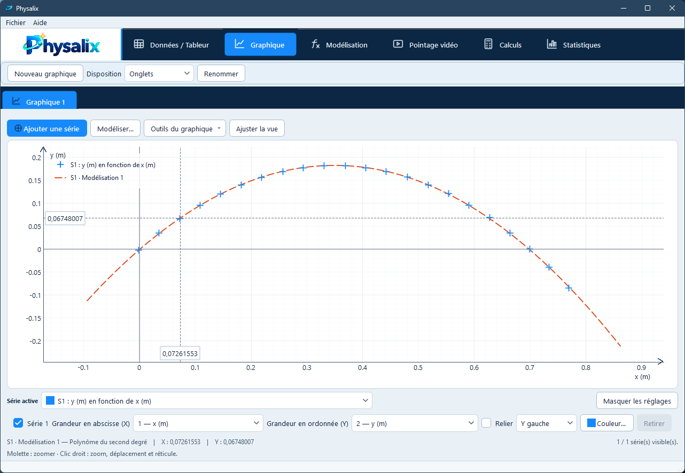
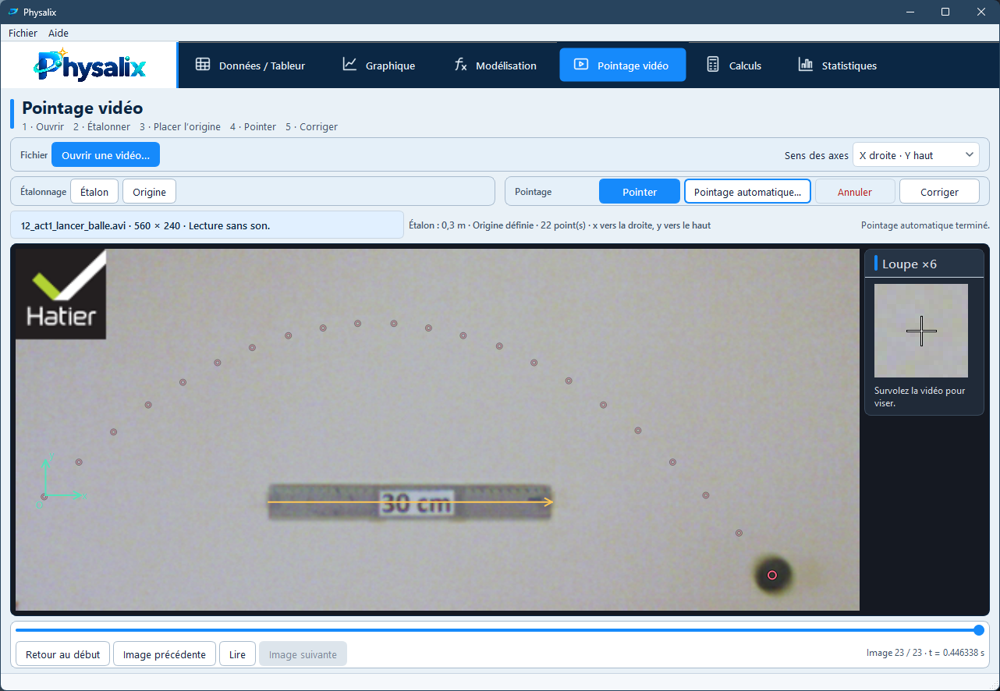
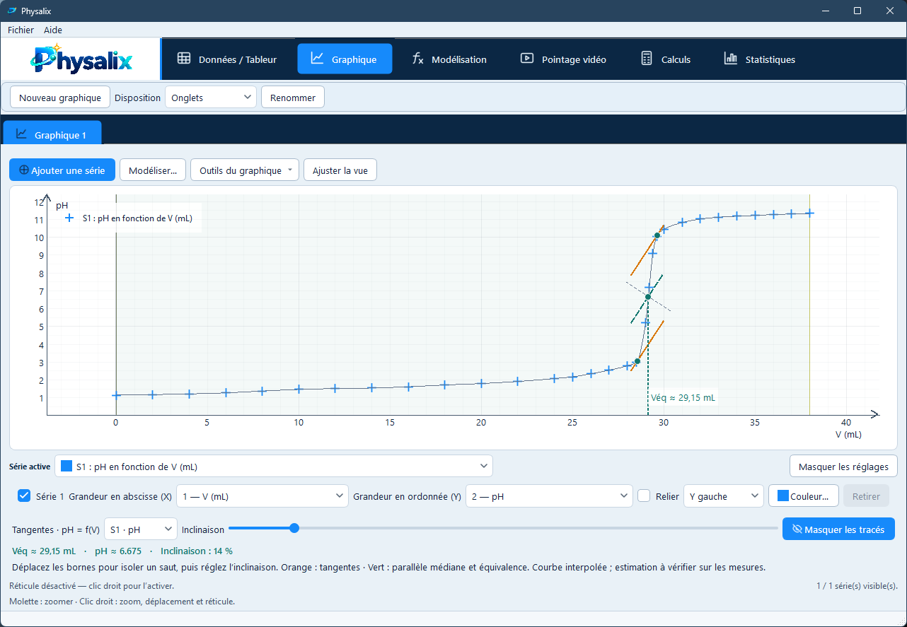
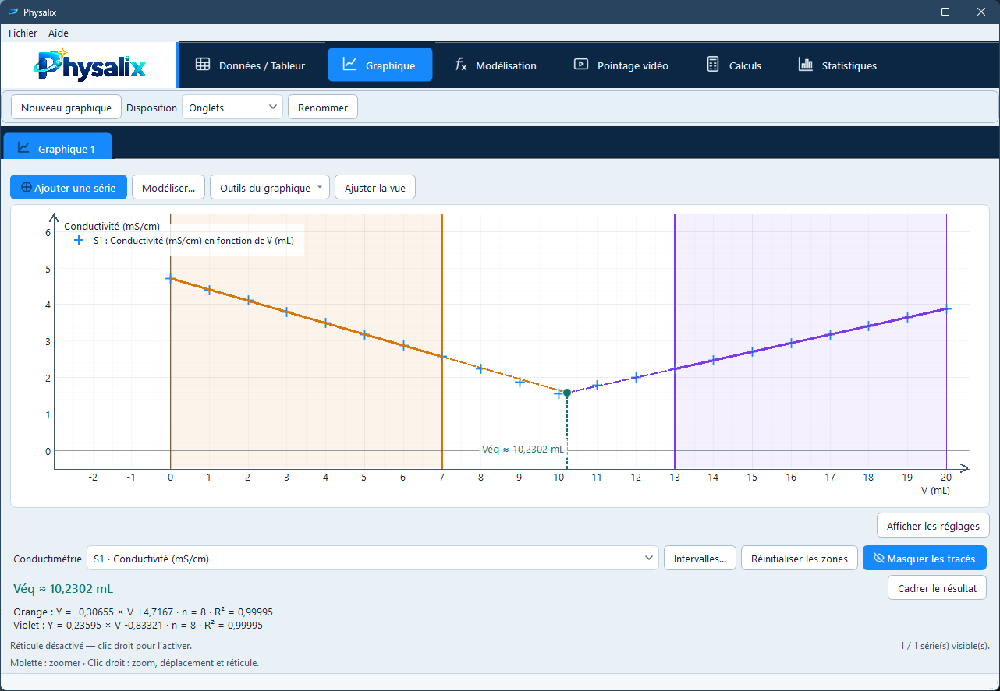

# Physalix

**Physalix** est un logiciel libre de physique-chimie pour Windows, conçu pour exploiter, analyser et modéliser des données expérimentales, notamment au lycée.

Il réunit dans une même application le tableur, le graphique, la modélisation, le pointage vidéo, les calculs et les statistiques.

## Télécharger

➡️ **[Télécharger la dernière version de Physalix](https://github.com/jeansittler/Physalix/releases/latest)**

L'installateur Windows est fourni dans chaque release. Physalix peut ensuite rechercher les nouvelles versions et proposer leur installation.

> **Remarque :** l'installateur public n'est pas encore signé numériquement. Windows ou l'antivirus peuvent donc afficher un avertissement lors du premier lancement.

## Fonctionnalités principales

- **Données / Tableur** — saisie de mesures, copier-coller, import/export CSV, formules de cellules et unités.
- **Graphique** — plusieurs séries, axes Y gauche/droite, zoom, réticule libre ou lié à une courbe et outils d'analyse.
- **Modélisation** — modèles linéaires, affines, polynomiaux, exponentiels, condensateur, sinusoïde et formule utilisateur.
- **Pointage vidéo** — étalonnage, origine, pointage manuel précis et pointage automatique optionnel avec arrêt conservateur en cas de perte de suivi.
- **Calculs** — dérivées numériques et création de nouvelles grandeurs par formule.
- **Statistiques** — indicateurs usuels, dispersion et incertitude-type A.
- **Dosages** — méthode des tangentes pour les dosages pH-métriques et détermination graphique de l'équivalence en conductimétrie.
- **Projets `.physalix`** — sauvegarde du travail pour le reprendre ou l'échanger.

## Aperçu

<table>
  <tr>
    <td width="50%" align="center">
      <strong>Graphique et modélisation</strong> 
      
    </td>
    <td width="50%" align="center">
      <strong>Pointage vidéo</strong> 
      
    </td>
  </tr>
  <tr>
    <td width="50%" align="center">
      <strong>Dosage pH-métrique</strong> 
      
    </td>
    <td width="50%" align="center">
      <strong>Titrage conductimétrique</strong> 
      
    </td>
  </tr>
</table>

## Installation

1. Ouvrez la page **[Releases](https://github.com/jeansittler/Physalix/releases/latest)**.
2. Téléchargez l'installateur `Physalix-Setup-...exe`.
3. Lancez l'installation.
4. Ouvrez ensuite Physalix depuis Windows.

Les projets utilisent l'extension `.physalix`.

## Développement et documentation

Physalix est développé en **Python** avec **PySide6** et **PyQtGraph**.

- [Construire Physalix sous Windows](BUILD_WINDOWS.md)
- [Contribuer au projet](CONTRIBUTING.md)
- [Procédure de release](RELEASE.md)
- [Signaler une vulnérabilité](SECURITY.md)
- [Politique de confidentialité](PRIVACY.md)
- [Composants et licences tierces](THIRD_PARTY_NOTICES.md)

Les bugs et propositions peuvent être signalés dans les **[issues GitHub](https://github.com/jeansittler/Physalix/issues)**.

## Confidentialité

Physalix n'intègre pas de télémétrie. Il contacte GitHub pour vérifier la disponibilité de nouvelles versions. Les détails sont décrits dans [PRIVACY.md](PRIVACY.md).

## Licence

Physalix est distribué sous licence **GNU GPL-3.0-only**. Voir [LICENSE](LICENSE).

Développé par **Jean Sittler**.